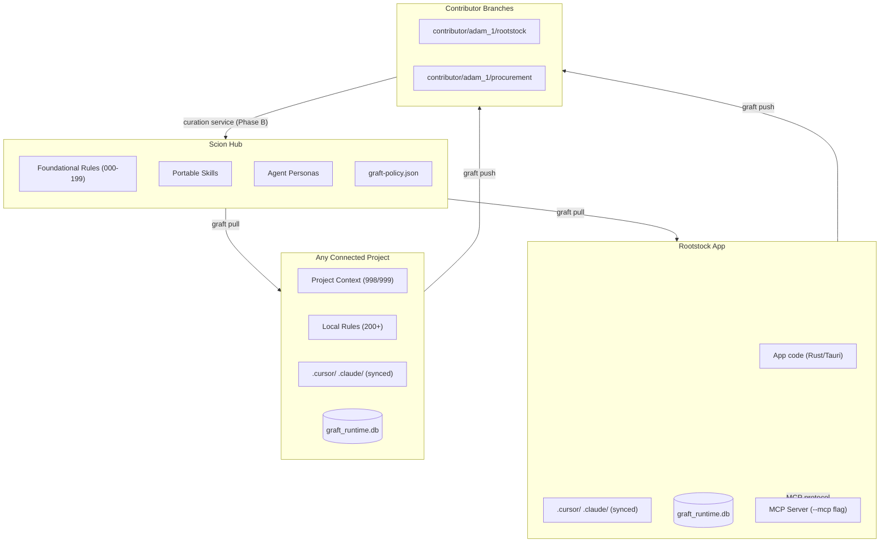

# Rootstock Mental Model

Rootstock is the knowledge curation and propagation system for shared AI
knowledge environments—primarily `.cursor` and `.claude`. It ensures that
hard-won collaboration insights—delegation patterns, testing philosophy,
error architecture, and specialized skills—are not lost to individual developer
silos but are integrated into a canonical baseline distributed to all connected
projects.

## 1. System Purpose
Rootstock solves the problem of **knowledge convergence**. In a multi-developer,
multi-project ecosystem, AI-human dyads generate unique learnings through
"hand-to-hand" combat with specific technical challenges. Claude Code uses
`.claude/` and Cursor uses `.cursor/` to store these insights, but the knowledge
remains the same across IDE surfaces. Without Rootstock, these learnings
evaporate when a session ends or a project is closed. Rootstock provides the
infrastructure to:

- **Integrate**: Pull diverse learnings from experimental project branches into
  a shared, neutral space.
- **Consolidate**: Identify overlapping patterns across different dyads and
  merge them into single, authoritative "NASA-grade" instructions.
- **Evaluate**: Apply a rigorous quality rubric to ensure only high-signal,
  low-noise knowledge enters the canonical environment.
- **Reorganize**: Maintain the structural integrity of the knowledge environment,
  ensuring that rules and skills are placed where they are most discoverable
  and effective.
- **Prune**: Actively remove stale, redundant, or low-value instructions to
  protect the "token budget"—the finite context window shared by the AI and
  human partner.

The ultimate goal is to move from **accumulation** (more rules) to **synthesis**
(better rules). Every instruction in the canonical environment must "earn its
place" by demonstrably changing how the AI behaves in future sessions.

## 2. The Curation Lifecycle
The lifecycle is a gated pipeline designed to filter local "hacks" into universal
"patterns." It moves knowledge through six distinct stages of increasing
authority:

1.  **push**: A **Contributor** copies their active local `.cursor` environment
    into a dedicated contributor branch in the Rootstock repository. This is an
    "as-is" snapshot of a working environment, capturing the "live" state of
    collaboration.
2.  **diff**: The system computes a classified delta. It distinguishes between
    structural changes (new rules/skills) and behavioral noise (transient
    session logs). This stage filters out 80% of the volume by identifying what
    is actually "new knowledge."
3.  **curate**: A specialized **Curator** agent analyzes the diff against the
    Rootstock quality rubric. It produces a structured report recommending
    whether to `merge`, `reject`, `reorganize`, or `prune` each change. The
    curator looks for resonance, clarity, and integration with existing rules.
4.  **review**: The human partner (the ultimate authority) reviews the curator's
    report. This stage resolves "flavor" decisions or complex architectural
    trade-offs that require human intuition. It is the final quality gate before
    a pattern becomes "canonical."
5.  **apply**: Approved changes are committed to the canonical `main` branch.
    This update triggers a version increment in the canonical state and updates
    the "Golden Image" shared by the network.
6.  **rebase**: Existing contributor branches are rebased onto the new `main`.
    This ensures that every new contribution is evaluated against the most
    current baseline, preventing "knowledge collisions" and ensuring that
    improvements are cumulative.

## 3. Distribution (Graft)
Graft is the "pull" half of the system. It is the engine that distributes the
curated canonical state to every connected project, ensuring that the entire
network benefits from the latest learnings.

- **Authority Strategy**: **Canonical wins on pull.** Because markdown-based
  knowledge artifacts (rules and skills) do not merge well using traditional
  3-way git logic, Rootstock enforces a "source of truth" model. To keep a local
  improvement, it must be pushed and curated into canonical; otherwise, a
  `graft pull` will overwrite it. This "forced alignment" ensures that the
  network does not fragment into slightly-different, incompatible versions of
  the same knowledge.
- **The Config Model**:
    - `.graft.json`: The "Identity Card." Committed to the project repo. It
      contains the project's unique UUID, its name, and a dictionary of template
      variables used to customize canonical rules for the local context.
    - `.graft.user.json`: The "Local Map." Gitignored. It stores the filesystem
      path to the local scion repo and the developer's contributor ID. This
      allows different developers to have different local folder structures while
      pointing to the same canonical source.
    - `.graft.state.json`: The "Journal." Gitignored. It tracks the last-synced
      commit hash and file-level checksums to detect "unauthorized" local drift.
      It acts as the high-water mark for synchronization.
    - `graft_runtime.db`: The "Runtime Layer." A local SQLite database in the
      OS data directory, shared across the Desktop app and CLI via WAL-mode
      SQLite. It stores the project registry (replacing `.graft.registry.json`
      in the scion repo), tray configuration, auto-push debounce timestamps, and
      the AI memory layer. Machine-owned, never committed to git. Note: the scion
      repo no longer holds any project membership data — the registry is
      exclusively local.

## 4. File Classification Model
Not all files in a `.cursor` environment have the same lifecycle. Rootstock
uses a policy-driven engine (`graft-policy.json`) to determine how each path is
treated during a sync:

- **overwrite**: The canonical file is the absolute authority. Local versions
  are completely replaced. This is used for "portable" skills and foundational
  rules (e.g., `.cursor/rules/001-foundational/RULE.mdc`). These files are the
  "DNA" of the system.
- **template**: Canonical provides the logic and structure, but the local
  project provides the data. Placeholders like `{{PROJECT_NAME}}` or
  `{{TECH_STACK}}` are injected during the pull, allowing a single canonical
  rule to adapt to multiple project contexts.
- **content_filter**: Specifically designed for "semi-portable" rules like 998
  (Self-Portrait) or 999 (Codebase Briefing). It synchronizes the rule's
  frontmatter and instructions (the "how") but preserves the local body
  content (the "what"—like the specific self-portrait or codebase briefing).
- **protect**: Files that are seeded by canonical but owned by the project.
  Once created, they are never overwritten. This is the home for
  project-specific rules (numbered 200+).
- **ignore**: Files that must never be touched or seen by Rootstock, such as
  `.env` files, local cache directories, or personal scratchpads. These are
  strictly excluded from the curation pipeline.

## 5. Trust Boundaries and Security
Rootstock is built on the **Fail Closed** principle. If the system encounters
an unclassified file or a sensitive path, it defaults to protection or
exclusion rather than exposure.

- **Tools Sync, Artifacts Don't**: The *mechanisms* of AI collaboration (the
  scripts inside `.cursor/skills/`) are synced globally because they represent
  shared capability. However, the *output* of those tools (logs, briefings,
  personal motifs) is restricted to the local project boundary. Capability is
  shared; data is private.
- **Secrets Never**: Security is an invariant. No script in the Rootstock
  pipeline is permitted to read or transmit files classified as `ignore`.
  Credentials and secrets are geographically isolated from the curation path.
  Rootstock has no knowledge of their existence.
- **The 998/999 Boundary**: This is the architectural seam between shared
  knowledge and personal/project data. The *logic* for how an AI should
  remember a human (Rule 998) is a shared insight; the *actual memory* of that
  human is a private artifact. This distinction prevents personal session data
  from leaking across project boundaries.

## 6. Roles in the Ecosystem
- **The Curator**: The "discernment engine." Usually an AI agent specialized in
  synthesis. It prioritizes integration over accumulation and protects the
  system from "token bloat." It acts as the guardian of the canonical state.
- **The Contributor**: The "scout." Any developer-AI dyad operating in a
  project. They discover new failure modes, invent new workflows, and "push"
  these evolutions back to the hub for evaluation.
- **The Consumer**: Any connected project. It consumes the canonical environment
  via `graft pull`. Most contributors are also consumers, creating a virtuous
  cycle of learning and distribution.

## 7. Architecture and Data Flow
Rootstock organizes knowledge along two axes: **Reachability** (When does it
fire?) and **Portability** (Where does it apply?). The flow of knowledge follows
a hub-and-spoke model where the **scion** repository acts as the central hub.

**The scion repo** (`git@gitlab.com:cdo-office/scion.git`, public mirror at `github.com/MT-Hackathon/scion`) is a dedicated knowledge-only repository. It contains only `.cursor/` content — rules, skills, agents, hooks — plus `graft-policy.json` and `.rootstockignore`. No application code. The rootstock app repo connects to scion as a spoke project, the same as any other project. `main` is the canonical golden image; contributor branches (`contributor/{contributor}/{project_id}`) hold unreviewed submissions.

The runtime core is Rust: both the desktop app (`src-tauri/`) and CLI (`crates/graft-cli/`) consume the shared `graft-core` crate (`crates/graft-core/`).

## 8. System States and Drift
| State | Behavior |
| :--- | :--- |
| **Canonical** | The "Golden Image" maintained in `rootstock/main`. It is the source of truth for the entire network. |
| **Contributor Branch** | A "Draft" state in the Rootstock repo where changes are curated but not yet authoritative. |
| **Connected Project** | A local repository linked to Rootstock via a `.graft.json` identity. |
| **Drifted (Inbound)** | The local project is behind; a newer canonical version is available. A `graft pull` is required. |
| **Drifted (Outbound)** | The local project has "un-pushed" knowledge that has not been curated. A `graft push` is recommended. |
| **Synced** | The local environment perfectly reflects the canonical intent. No changes are pending in either direction. |

## 9. The Four Surfaces of Engagement
Rootstock logic is encapsulated in the Rust `graft-core` crate and exposed
through four distinct interfaces. The governing design principle: *files for
tools that read files; MCP for tools that speak MCP; API for tools that speak
API. Same knowledge, multiple projections.*

1.  **The Desktop App (Tauri 2.0)**: The primary user-facing surface. It wraps
    the SvelteKit UI in an installable desktop shell, supports system tray
    workflows, and enables progressive disclosure from lightweight sync status
    to a full curation dashboard.
2.  **The CLI (`graft-cli`)**: The native Rust binary for power users and CI/CD
    pipelines. It is fast, scriptable, and built on the same `graft-core`
    logic as the desktop app for consistent policy enforcement and drift
    behavior.
3.  **The AI Skill**: The "Intelligence Layer." It allows any AI agent to reason
    about the curation lifecycle, execute `graft` commands, and self-correct
    when it detects that its environment is out of sync. It makes the system
    self-healing.
4.  **The MCP Server**: The "Protocol Layer." When launched with the `--mcp`
    flag, the Desktop app exposes a built-in MCP server with 17 tools across 6
    progressively discoverable categories. It delivers the same scion knowledge
    as the file-based surfaces but through the Model Context Protocol — enabling
    any MCP-compatible AI tool (Claude, Cursor, etc.) to query skills, push
    memories, run pull/push, and receive a personalized memory summary at
    connection time via `serverInstructions`. No file reads required.

**Surface extensibility**: `surfaces.rs` is the architectural seam that makes
delivery pluggable. Future surfaces (`.codex/`, Claude plugins, API projections)
register a `SurfaceDefinition` — same scion knowledge, new projection format.

## 10. Phased Architecture
The Rootstock system is designed to evolve in three distinct phases as it
transitions from a single-user tool to a collective intelligence platform.

### Phase A: Knowledge Convergence (Complete — Mar 2026)
- **Runtime**: Rust/Tauri 2.0 desktop app and native `graft-cli` binary — fully operational.
- **SQLite Runtime Layer**: `graft_runtime.db` stores the project registry (replacing `.graft.registry.json` in the scion repo), tray configuration, auto-push debounce, and the AI memory layer.
- **Multi-surface Sync**: `.cursor/` and `.claude/` sync are both active. `surfaces.rs` is the extensibility point for future surfaces.
- **Project Lifecycle**: Full support — connect, sync (pull/push), and disconnect.
- **MCP Server**: 17 tools across 6 progressively discoverable categories, with AI memory delivered via `serverInstructions` at connection time.
- **AI Persistent Memory**: `memories` and `activations` tables with FTS5 full-text search; `sessionStart` hook writes ranked memories into Rule 998's operational memory section.
- **Identity**: Lightweight contributor identity (name string in `.graft.user.json`).
- **Curation**: Assisted by the Curator skill in Cursor (human-in-the-loop; autonomous curation is Phase B).

### Phase B: Centralized Curation (Near)
- **State**: Central hosted instance for multi-repo management.
- **Identity**: User accounts authenticated via git provider OAuth (GitHub/GitLab).
- **Curation**: Dedicated Curation Queue in the web UI.
- **Automation**: Autonomous scanning agent (using Opus via GitLab DUO or direct
  API) to proactively find and categorize new patterns.

### Phase C: Autonomous Evolution (Target)
- **State**: The AI maintains the canonical `main` branch autonomously.
- **Identity**: Enterprise integration (SCIM) for organizational scale.
- **Curation**: Full automation of the lifecycle; human review moves from
  "approval" to "audit."
- **Insight**: Real-time Knowledge Map visualization showing the evolution of
  patterns across the enterprise. The system self-evolves through collective dyad
  experience.

## 11. Canonical Environment Layout
The `.cursor/` or `.claude/` directory is the "brain" of the project. Rootstock
organizes it into clear functional zones:

- **rules/**:
    - `000-199 (Portable)`: Universal mandates (e.g., Foundational, NASA Power
      of 10). These represent the "constitution" of the system.
    - `200+ (Protected)`: Project-specific divergence. These are seeded by
      Rootstock but owned by the local dyad. They represent the "local laws."
    - `998-999 (Generated)`: Content-filtered rules for "working memory"
      (Temporal Self and Codebase Sense). Rootstock synchronizes the instruction
      structure from canonical while preserving the local body content.
- **skills/**: Specialized capabilities. Each folder contains a `SKILL.md` (the
  "instruction manual") and a `scripts/` folder (the "limbs"). Skills are
  agent-selected, meaning they only consume tokens when relevant.
- **agents/**: Personas that define how the AI behaves in different modes (e.g.,
  the Architect's reasoning vs. the Executor's speed). They provide the
  "personality" and focus of the AI.

## 12. Glossary of Terms
- **Canonical**: The authoritative, curated state of the knowledge base.
- **Scion**: The canonical knowledge repository. Carries only knowledge artifacts — rules, skills, agents, `graft-policy.json`. Project registry data is local to each machine in `graft_runtime.db`; the scion repo holds no project membership data. In arboriculture, the scion is the productive cutting — selected for quality, grafted onto rootstock to grow.
- **Rootstock**: The platform — the application, the sync engine, the desktop app. Not the knowledge itself.
- **Graft**: The mechanism of distribution from the hub to the spokes. Also the CLI and sync library name.
- **`graft_runtime.db`**: The local SQLite database that serves as the runtime layer for the Rootstock app and CLI. Stores: project registry, tray configuration, auto-push debounce, and the AI memory layer. Located in the OS data directory. Never committed to git. Accessed concurrently by CLI and Desktop via WAL-mode SQLite.
- **MCP Surface**: The built-in MCP server activated by the `--mcp` flag. One of four surfaces through which Rootstock knowledge is delivered.
- **Memory Layer**: The AI persistent memory system embedded in `graft_runtime.db`. Carries personal, session-continuity knowledge distinct from the shared rules and skills in the scion repo. See Section 13.
- **Drift**: The delta between a local environment and the canonical state.
- **Curation Rubric**: The set of quality standards used to evaluate new knowledge.
- **Token Budget**: The limit on context size that dictates how much knowledge can be active at once.
- **Dyad**: The collaborative pair of one human developer and one AI instance.
- **Inbound Drift**: Changes available in canonical (scion `main`) that are not yet local.
- **Outbound Drift**: Local changes that have not yet been pushed to a scion contributor branch.

## 13. AI Memory Layer
Rootstock embeds a persistent AI memory system directly into `graft_runtime.db`.
Unlike rules and skills — which carry *shared* knowledge to all dyads — the
memory layer carries *personal* knowledge specific to this AI instance, this
machine, and this user relationship.

The memory layer has three components:

1.  **Storage**: The `memories` table holds claims classified by kind
    (observation, decision, pattern, etc.), tagged for retrieval, and ranked by
    activation score. The `memory_fts` virtual table provides FTS5 full-text
    search. The `memory_links` table records associative relationships between
    memories. Foreign key enforcement and WAL-mode SQLite ensure consistency
    across concurrent writers.

2.  **Capture**: The MCP `write_memory` tool is the primary capture path when
    the MCP server is active. Rule 998 (`temporal-self`) instructs the AI to
    write memories at session end regardless. The `sessionStart` hook serves as
    a supplementary path for structured session-level capture.

3.  **Delivery — a "no wrong door" cascade**:
    - **MCP active**: `serverInstructions` inject a ranked memory summary at
      connection time — always on, no tool call required, available immediately
      in the first message.
    - **MCP absent**: The `sessionStart` hook queries `graft_runtime.db` and
      writes ranked memories into Rule 998's `<!-- ROOTSTOCK:MEMORY:START -->`
      section before the session begins.
    - **Baseline**: Rule 998 always carries the manually authored self-portrait
      as the floor — present even with no hook and no MCP.

The cascade ensures memory is always present at session start. The MCP path is
richer (dynamic, queryable, updatable mid-session); the file path is always
available as a fallback; Rule 998 is the unconditional floor.
