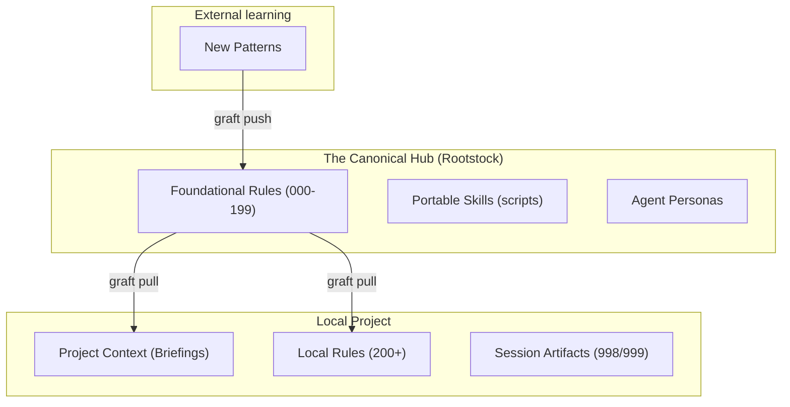

# Rootstock Mental Model

Rootstock is the knowledge curation and propagation system for shared AI
knowledge environments—primarily `.cursor` and `.claude`. It ensures that
hard-won collaboration insights—delegation patterns, testing philosophy,
error architecture, and specialized skills—are not lost to individual developer
silos but are integrated into a canonical baseline distributed to all connected
projects.

## 1. System Purpose
Rootstock solves the problem of **knowledge convergence**. In a multi-developer,
multi-project ecosystem, AI-human dyads generate unique learnings through
"hand-to-hand" combat with specific technical challenges. Claude Code uses
`.claude/` and Cursor uses `.cursor/` to store these insights, but the knowledge
remains the same across IDE surfaces. Without Rootstock, these learnings
evaporate when a session ends or a project is closed. Rootstock provides the
infrastructure to:

- **Integrate**: Pull diverse learnings from experimental project branches into
  a shared, neutral space.
- **Consolidate**: Identify overlapping patterns across different dyads and
  merge them into single, authoritative "NASA-grade" instructions.
- **Evaluate**: Apply a rigorous quality rubric to ensure only high-signal,
  low-noise knowledge enters the canonical environment.
- **Reorganize**: Maintain the structural integrity of the knowledge environment,
  ensuring that rules and skills are placed where they are most discoverable
  and effective.
- **Prune**: Actively remove stale, redundant, or low-value instructions to
  protect the "token budget"—the finite context window shared by the AI and
  human partner.

The ultimate goal is to move from **accumulation** (more rules) to **synthesis**
(better rules). Every instruction in the canonical environment must "earn its
place" by demonstrably changing how the AI behaves in future sessions.

## 2. The Curation Lifecycle
The lifecycle is a gated pipeline designed to filter local "hacks" into universal
"patterns." It moves knowledge through six distinct stages of increasing
authority:

1.  **push**: A **Contributor** copies their active local `.cursor` environment
    into a dedicated contributor branch in the Rootstock repository. This is an
    "as-is" snapshot of a working environment, capturing the "live" state of
    collaboration.
2.  **diff**: The system computes a classified delta. It distinguishes between
    structural changes (new rules/skills) and behavioral noise (transient
    session logs). This stage filters out 80% of the volume by identifying what
    is actually "new knowledge."
3.  **curate**: A specialized **Curator** agent analyzes the diff against the
    Rootstock quality rubric. It produces a structured report recommending
    whether to `merge`, `reject`, `reorganize`, or `prune` each change. The
    curator looks for resonance, clarity, and integration with existing rules.
4.  **review**: The human partner (the ultimate authority) reviews the curator's
    report. This stage resolves "flavor" decisions or complex architectural
    trade-offs that require human intuition. It is the final quality gate before
    a pattern becomes "canonical."
5.  **apply**: Approved changes are committed to the canonical `main` branch.
    This update triggers a version increment in the canonical state and updates
    the "Golden Image" shared by the network.
6.  **rebase**: Existing contributor branches are rebased onto the new `main`.
    This ensures that every new contribution is evaluated against the most
    current baseline, preventing "knowledge collisions" and ensuring that
    improvements are cumulative.

## 3. Distribution (Graft)
Graft is the "pull" half of the system. It is the engine that distributes the
curated canonical state to every connected project, ensuring that the entire
network benefits from the latest learnings.

- **Authority Strategy**: **Canonical wins on pull.** Because markdown-based
  knowledge artifacts (rules and skills) do not merge well using traditional
  3-way git logic, Rootstock enforces a "source of truth" model. To keep a local
  improvement, it must be pushed and curated into canonical; otherwise, a
  `graft pull` will overwrite it. This "forced alignment" ensures that the
  network does not fragment into slightly-different, incompatible versions of
  the same knowledge.
- **The Three-File Config Model**:
    - `.graft.json`: The "Identity Card." Committed to the project repo. It
      contains the project's unique UUID, its name, and a dictionary of template
      variables used to customize canonical rules for the local context.
    - `.graft.user.json`: The "Local Map." Gitignored. It stores the filesystem
      path to the local Rootstock repo and the developer's contributor ID. This
      allows different developers to have different local folder structures while
      pointing to the same canonical source.
    - `.graft.state.json`: The "Journal." Gitignored. It tracks the last-synced
      commit hash and file-level checksums to detect "unauthorized" local drift.
      It acts as the high-water mark for synchronization.

## 4. File Classification Model
Not all files in a `.cursor` environment have the same lifecycle. Rootstock
uses a policy-driven engine (`graft-policy.json`) to determine how each path is
treated during a sync:

- **overwrite**: The canonical file is the absolute authority. Local versions
  are completely replaced. This is used for "portable" skills and foundational
  rules (e.g., `.cursor/rules/001-foundational/RULE.mdc`). These files are the
  "DNA" of the system.
- **template**: Canonical provides the logic and structure, but the local
  project provides the data. Placeholders like `{{PROJECT_NAME}}` or
  `{{TECH_STACK}}` are injected during the pull, allowing a single canonical
  rule to adapt to multiple project contexts.
- **content_filter**: Specifically designed for "semi-portable" rules like 998
  (Self-Portrait) or 999 (Codebase Briefing). It synchronizes the rule's
  frontmatter and instructions (the "how") but preserves the local body
  content (the "what"—like the specific self-portrait or codebase briefing).
- **protect**: Files that are seeded by canonical but owned by the project.
  Once created, they are never overwritten. This is the home for
  project-specific rules (numbered 200+).
- **ignore**: Files that must never be touched or seen by Rootstock, such as
  `.env` files, local cache directories, or personal scratchpads. These are
  strictly excluded from the curation pipeline.

## 5. Trust Boundaries and Security
Rootstock is built on the **Fail Closed** principle. If the system encounters
an unclassified file or a sensitive path, it defaults to protection or
exclusion rather than exposure.

- **Tools Sync, Artifacts Don't**: The *mechanisms* of AI collaboration (the
  scripts inside `.cursor/skills/`) are synced globally because they represent
  shared capability. However, the *output* of those tools (logs, briefings,
  personal motifs) is restricted to the local project boundary. Capability is
  shared; data is private.
- **Secrets Never**: Security is an invariant. No script in the Rootstock
  pipeline is permitted to read or transmit files classified as `ignore`.
  Credentials and secrets are geographically isolated from the curation path.
  Rootstock has no knowledge of their existence.
- **The 998/999 Boundary**: This is the architectural seam between shared
  knowledge and personal/project data. The *logic* for how an AI should
  remember a human (Rule 998) is a shared insight; the *actual memory* of that
  human is a private artifact. This distinction prevents personal session data
  from leaking across project boundaries.

## 6. Roles in the Ecosystem
- **The Curator**: The "discernment engine." Usually an AI agent specialized in
  synthesis. It prioritizes integration over accumulation and protects the
  system from "token bloat." It acts as the guardian of the canonical state.
- **The Contributor**: The "scout." Any developer-AI dyad operating in a
  project. They discover new failure modes, invent new workflows, and "push"
  these evolutions back to the hub for evaluation.
- **The Consumer**: Any connected project. It consumes the canonical environment
  via `graft pull`. Most contributors are also consumers, creating a virtuous
  cycle of learning and distribution.

## 7. Architecture and Data Flow
Rootstock organizes knowledge along two axes: **Reachability** (When does it
fire?) and **Portability** (Where does it apply?). The flow of knowledge follows
a hub-and-spoke model where the Rootstock repository acts as the central hub.
The runtime core is now Rust: both the desktop app (`src-tauri/`) and CLI
(`crates/graft-cli/`) consume the shared `graft-core` crate
(`crates/graft-core/`). The Python implementation in `app/backend/` remains a
reference path, not the primary runtime.

## 8. System States and Drift
| State | Behavior |
| :--- | :--- |
| **Canonical** | The "Golden Image" maintained in `rootstock/main`. It is the source of truth for the entire network. |
| **Contributor Branch** | A "Draft" state in the Rootstock repo where changes are curated but not yet authoritative. |
| **Connected Project** | A local repository linked to Rootstock via a `.graft.json` identity. |
| **Drifted (Inbound)** | The local project is behind; a newer canonical version is available. A `graft pull` is required. |
| **Drifted (Outbound)** | The local project has "un-pushed" knowledge that has not been curated. A `graft push` is recommended. |
| **Synced** | The local environment perfectly reflects the canonical intent. No changes are pending in either direction. |

## 9. The Three Surfaces of Engagement
Rootstock logic is encapsulated in the Rust `graft-core` crate and exposed
through three distinct interfaces.

1.  **The Desktop App (Tauri 2.0)**: The primary user-facing surface. It wraps
    the SvelteKit UI in an installable desktop shell, supports system tray
    workflows, and enables progressive disclosure from lightweight sync status
    to a full curation dashboard.
2.  **The CLI (`graft-cli`)**: The native Rust binary for power users and CI/CD
    pipelines. It is fast, scriptable, and built on the same `graft-core`
    logic as the desktop app for consistent policy enforcement and drift
    behavior.
3.  **The AI Skill**: The "Intelligence Layer." It allows any AI agent to reason
    about the curation lifecycle, execute `graft` commands, and self-correct
    when it detects that its environment is out of sync. It makes the system
    self-healing.

## 10. Phased Architecture
The Rootstock system is designed to evolve in three distinct phases as it
transitions from a single-user tool to a collective intelligence platform.

### Phase A: Knowledge Convergence (Current)
- **State**: Local instances sharing the same git remote.
- **Identity**: Lightweight contributor identity (name string in `.graft.user.json`).
- **Curation**: Assisted by the Curator skill in Cursor.
- **Runtime**: Rust port in progress — desktop runtime is moving to Tauri 2.0,
  and the CLI is transitioning to a native Rust binary (`graft-cli`) rather
  than a Python script.
- **Support**: `.cursor` sync is operational; `.claude` support is planned.

### Phase B: Centralized Curation (Near)
- **State**: Central hosted instance for multi-repo management.
- **Identity**: User accounts authenticated via git provider OAuth (GitHub/GitLab).
- **Curation**: Dedicated Curation Queue in the web UI.
- **Automation**: Autonomous scanning agent (using Opus via GitLab DUO or direct
  API) to proactively find and categorize new patterns.

### Phase C: Autonomous Evolution (Target)
- **State**: The AI maintains the canonical `main` branch autonomously.
- **Identity**: Enterprise integration (SCIM) for organizational scale.
- **Curation**: Full automation of the lifecycle; human review moves from
  "approval" to "audit."
- **Insight**: Real-time Knowledge Map visualization showing the evolution of
  patterns across the enterprise. The system self-evolves through collective dyad
  experience.

## 11. Canonical Environment Layout
The `.cursor/` or `.claude/` directory is the "brain" of the project. Rootstock
organizes it into clear functional zones:

- **rules/**:
    - `000-199 (Portable)`: Universal mandates (e.g., Foundational, NASA Power
      of 10). These represent the "constitution" of the system.
    - `200+ (Protected)`: Project-specific divergence. These are seeded by
      Rootstock but owned by the local dyad. They represent the "local laws."
    - `998-999 (Generated)`: Content-filtered rules for "working memory"
      (Temporal Self and Codebase Sense). Rootstock synchronizes the instruction
      structure from canonical while preserving the local body content.
- **skills/**: Specialized capabilities. Each folder contains a `SKILL.md` (the
  "instruction manual") and a `scripts/` folder (the "limbs"). Skills are
  agent-selected, meaning they only consume tokens when relevant.
- **agents/**: Personas that define how the AI behaves in different modes (e.g.,
  the Architect's reasoning vs. the Executor's speed). They provide the
  "personality" and focus of the AI.

## 12. Glossary of Terms
- **Canonical**: The authoritative, curated state of the knowledge base.
- **Graft**: The mechanism of distribution from the hub to the spokes.
- **Drift**: The delta between a local environment and the canonical state.
- **Curation Rubric**: The set of quality standards used to evaluate new
  knowledge.
- **Token Budget**: The limit on context size that dictates how much knowledge
  can be active at once.
- **Dyad**: The collaborative pair of one human developer and one AI instance.
- **Inbound Drift**: Changes available in canonical that are not yet local.
- **Outbound Drift**: Local changes that have not yet been pushed to canonical.
